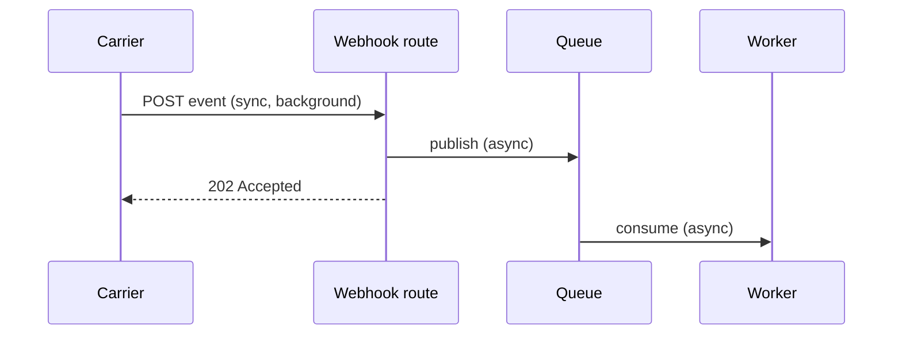

# High-Level Design

## Overview

Requirements say *what* the system must do. High-level design decides *what shape of system* will do it, and fixes the contracts that more than one task will build against. Skipping it doesn't remove those decisions; it scatters them across tasks, where each implementation makes its own silent, inconsistent choice. The test for a finished design: "If we build this shape, will it realistically meet the requirements, and can each task be built without re-deciding anything shared?"

The design has two layers:

- **Shape** — what you could draw on a whiteboard in ten minutes: components, flows, data ownership, and how each non-functional requirement is met.
- **Shared contracts** — the spec-sheet details that several tasks depend on: API contracts, schema changes, status lifecycles, cross-component failure policy. Decide these here, once, before tasks are planned.

Everything local to a single task — internal functions, local edge cases — is left to the `low-level-design` skill.

## When to Use

- A spec or user story has approved functional and non-functional requirements, and tasks have not been planned yet
- The change adds or reshapes a service, module, data store, queue, or third-party integration
- Several tasks will share an API, a table, a status field, or an event stream
- An epic needs its architecture settled before stories are cut

**When NOT to use:**

- Requirements are still unclear. Use `spec-driven-development` (or `interview-me`) first; designing against guessed requirements produces a confident wrong design.
- The change lives inside one existing module and touches no shared contract. Go straight to `planning-and-task-breakdown`, then `low-level-design` per task.
- You only need one interface's surface (fields, errors, versioning). Use `api-and-interface-design`.

## The Process

Work top-down. Finish the shape layer before the contracts layer; contracts written before the shape is agreed get rewritten.

### Step 1: Load inputs and read what exists

- Read the spec. Give every functional requirement and non-functional requirement a stable id (`FR1`, `NFR1`) if it lacks one; the design traces back to these.
- Read `CONSTRAINTS.md` if the project has one (see `constraint-driven-development`); its thresholds are non-functional requirements too.
- Read the existing architecture: current services, data stores, integration points, and existing ADRs. Extend what exists before inventing something new.

### Step 2: Scope

Write what the design covers and, explicitly, what it does **not**. The out-of-scope list is what stops the design, and later the tasks, from quietly growing. Add a small context diagram: the system as one box, with the users and external systems around it.

### Step 3: Components and responsibilities

List each component the change touches — new or modified — with one line on what it owns. One owner per responsibility. If a new component's job could be done by modifying an existing one, prefer the modification and say why it isn't enough if you still add one.

### Step 4: Flows

Draw the main flows as sequence diagrams. Label every hop **sync** or **async**, and mark each flow **critical path** (a user waits on it) or **background**. Draw the happy path plus only the failure paths that change the design (for example, "the carrier is down, so ingestion must be async"). Exhaustive edge cases belong in `low-level-design`.



### Step 5: Data ownership

For each entity the change touches: which component owns (writes) it, who else reads it and how, and the retention or regulatory rule that applies (retention period, deletion, personal-data handling). Name the entities and the migration strategy here. Column-level detail goes in Step 10 only if more than one task depends on it.

### Step 6: Non-functional requirements → mechanisms

Never restate a target without a mechanism. For each NFR:

| NFR | Target | Mechanism | How it's verified |
|---|---|---|---|
| NFR1 | p95 status read < 200 ms | Read from a cache keyed by order id, invalidated by the worker | Load test on the read endpoint |
| NFR3 | No cross-account reads | Ownership check in the read handler, comparing the caller's account with the order's owner | Negative test: account A reads account B's order → 404 |

An NFR with no mechanism is an unmet requirement.

### Step 7: Integrations and consistency

For each external or cross-component call: timeout, retry and backoff, circuit breaker if the dependency can degrade, and whether the result is **strongly** or **eventually** consistent. If eventual, state how stale the data can be and what the user sees meanwhile.

### Step 8: Security and compliance

A separate pass, not a line inside Step 6: how callers authenticate, where authorization and tenant or ownership scoping are enforced, trust boundaries (which inputs are untrusted), encryption, and which sensitive fields must never be logged. Pull in `security-and-hardening` when the change handles untrusted input or sensitive data.

### Step 9: Rollout shape

One or two lines: feature flag or not, migration order (expand → deploy → contract), and a canary or staged rollout if the blast radius warrants it. `shipping-and-launch` owns the full checklist.

### Step 10: Shared contracts

For each item below, write it down only if **more than one task** depends on it. A contract used by a single task belongs in that task's low-level design.

- **API contracts** — method, path, request and response with concrete JSON examples for success and each error. Follow `api-and-interface-design` for the rules; this step only records the decisions.
- **Schema changes** — tables and columns with types and nullability, constraints, *why* each index exists, soft or hard delete.
- **Status lifecycles** — any field with statuses gets a transition table: allowed transitions, terminal states, and a decided outcome for every invalid transition (reject, ignore and log, or alert). Don't let an implementer improvise it.
- **Failure policy at shared boundaries** — idempotency key, retry count and backoff, dead-letter handling, and what a partial write leaves behind.

### Step 11: Alternatives and decision

Compare at least two viable designs for the decisions that are expensive to reverse (sync versus async, new store versus existing, build versus buy). State the tradeoff in terms of the NFRs. Record each chosen decision as an ADR using `documentation-and-adrs`.

### Step 12: Doubt, then human approval

Run the design through `doubt-driven-development` with the spec as the contract: a fresh-context reviewer looks for requirements with no design element, NFRs with no mechanism, and failure paths nobody owns. Fold the findings back in, then present the design for human approval. Tasks are planned only against an approved design.

## Output

Write the design into the spec as a `## Design` section (or a sibling `design.md` if the spec is already long), so it lives in the repository next to the code:

```markdown
## Design

### Scope
In: … | Out: … | Context diagram

### Components
| Component | New/changed | Owns | Serves |

### Flows
Sequence diagrams, each hop labelled sync/async, each flow critical/background

### Data
| Entity | Owner | Readers | Retention/regulatory | Migration |

### NFR mechanisms
| NFR | Target | Mechanism | Verification |

### Integrations
| Dependency | Timeout | Retry/backoff | Consistency |

### Security
AuthN, AuthZ/tenant scoping point, trust boundaries, never-logged fields

### Rollout
Flag, migration order, staged rollout

### Shared contracts
C1 API … · C2 schema … · C3 status transitions … · C4 failure policy …

### Decisions
ADR links, alternatives considered
```

Give each shared contract a stable id (`C1`, `C2`) so tasks can cite exactly what they depend on. Every component, flow, and contract should trace to at least one `FR`/`NFR` id; an element that traces to nothing is scope creep.

**Keep the design alive.** When implementation reveals the design was wrong, update the `## Design` section in the same pull request as the code. A design that disagrees with the code is worse than no design.

## Common Rationalizations

| Rationalization | Reality |
|---|---|
| "The design is obvious, I'll just plan the tasks" | Then writing it down takes ten minutes. If it isn't obvious, the tasks will each decide it differently. |
| "We'll figure out retries and duplicates during implementation" | Then every task makes a different call. Idempotency and failure policy are contracts, not details. |
| "The NFRs are listed in the spec, that covers them" | A target without a mechanism is a wish. Name the cache, index, queue, or check that meets it. |
| "Only one sensible option exists" | Then comparing two takes one paragraph. Usually a cheaper option was never considered. |
| "Full schema and class diagrams make the design complete" | They make it unreadable and stale by next week. Record only what more than one task depends on. |
| "The design doc is done, the code is the truth now" | When they disagree, the next person trusts the wrong one. Update the design in the same PR. |

## Red Flags

- An NFR restated as a target with no mechanism beside it
- No out-of-scope list
- A flow with no sync/async label, or a user waiting on something marked async
- A status field that more than one task writes, with no transition table
- A shared boundary with no stated idempotency or retry rule
- The shape layer reads like code: class names, full DDL, every edge case
- A new component where extending an existing one would do, with no reason given
- A design element that traces to no requirement id
- Tasks planned before the design was approved

## Verification

- [ ] Every FR and NFR id maps to at least one design element, and every element traces back to one
- [ ] Out-of-scope is written down
- [ ] Every flow hop is labelled sync/async and every flow critical/background
- [ ] Every NFR has a mechanism and a verification method
- [ ] Data ownership and retention are stated for every entity touched
- [ ] Every contract shared by two or more tasks has a stable id and concrete examples
- [ ] Every status field has a transition table with decided invalid-transition behaviour
- [ ] At least two alternatives were compared for hard-to-reverse decisions, and ADRs are recorded
- [ ] A fresh-context doubt pass ran and its findings were resolved
- [ ] The human approved the design before task planning started
